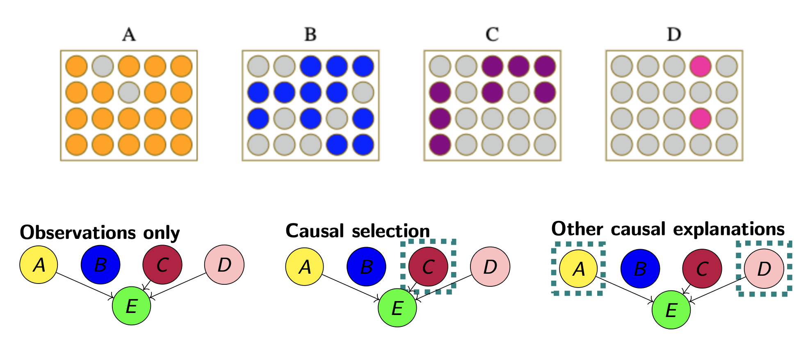

---

##### Download

+ [Paper](Causal_Selection_Explanations_for_Causal_Inference_Cogsci.pdf)

---

##### Abstract

Building on counterfactual theories of causal-selection, according to which humans intuitively evaluate the causal responsibility of events, we developed an experimental paradigm to examine the effect of causal-selection explanations on abductive causal inference. In our experiment, participants attempted to infer the rule responsible for winning outcomes of random draws from urns with varying sampling probabilities.
Participants who were provided with causal-selection judgments as explanations for the outcomes made significantly closer inferences to the rule than those relying on observations alone, or on other explanations of causal relevance.
We mirror these empirical results with a computational model of inference from explanation leveraging the theories of causal selection.

---

##### Explanation conditions



---

##### Citation

Navarre, N., Konuk, C., Bramley, N. R., & Mascarenhas, S. (2024). Functional rule inference from causal selection explanations. In Proceedings of the Annual Meeting of the Cognitive Science Society (Vol. 46).

```latex

@inproceedings{navarre2024functional,
  title={Functional rule inference from causal selection explanations},
  author={Navarre, Nicolas and Konuk, Can and Bramley, Neil R and Mascarenhas, Salvador},
  booktitle={Proceedings of the Annual Meeting of the Cognitive Science Society},
  volume={46},
  year={2024}
}

```

---

##### Related material

+ [Presentation slides](cogsci2024-inference.pdf)
+ [Poster](comco2023-inference.pdf)
